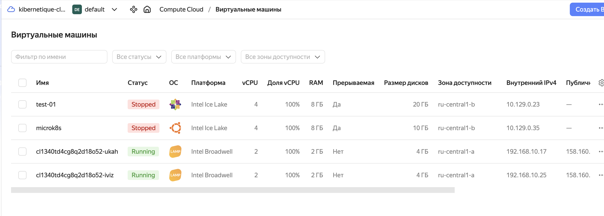
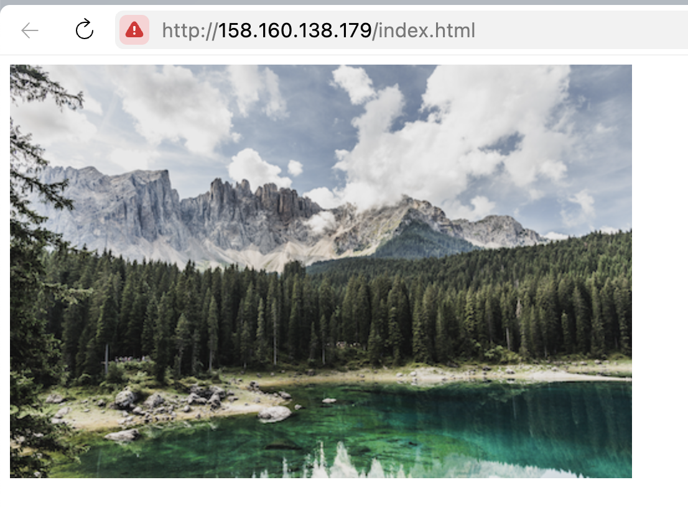

# Домашнее задание к занятию «Вычислительные мощности. Балансировщики нагрузки»  

---
## Задание 1. Yandex Cloud 

**Что нужно сделать**

1. Создать бакет Object Storage и разместить в нём файл с картинкой:

 - Создать бакет в Object Storage с произвольным именем (например, _имя_студента_дата_).  
[bucket.tf#L2-L8](https://github.com/kibernetiq/netology_cloud/blob/cloud-15-2/bucket.tf#L2-L8)
 - Положить в бакет файл с картинкой.  
[bucket.tf#L11-L19](https://github.com/kibernetiq/netology_cloud/blob/cloud-15-2/bucket.tf#L11-L19)
 - Сделать файл доступным из интернета.  
[https://storage.yandexcloud.net/test-storage-picture/123.png](https://storage.yandexcloud.net/test-storage-picture/123.png)
 
2. Создать группу ВМ в public подсети фиксированного размера с шаблоном LAMP и веб-страницей, содержащей ссылку на картинку из бакета:

 - Создать Instance Group с тремя ВМ и шаблоном LAMP. Для LAMP рекомендуется использовать `image_id = fd827b91d99psvq5fjit`.  
 [main.tf](https://github.com/kibernetiq/netology_cloud/blob/cloud-15-2/main.tf)
 - Для создания стартовой веб-страницы рекомендуется использовать раздел `user_data` в [meta_data](https://cloud.yandex.ru/docs/compute/concepts/vm-metadata).
 - Разместить в стартовой веб-странице шаблонной ВМ ссылку на картинку из бакета.  
 [main.tf#L26](https://github.com/kibernetiq/netology_cloud/blob/cloud-15-2/main.tf#L26)
 - Настроить проверку состояния ВМ.  
 [main.tf#L50-L55](https://github.com/kibernetiq/netology_cloud/blob/cloud-15-2/main.tf#L50-L55)
 
3. Подключить группу к сетевому балансировщику:

 - Создать сетевой балансировщик.  
 [network.tf#L14-L40](https://github.com/kibernetiq/netology_cloud/blob/cloud-15-2/network.tf#L14-L40)
 - Проверить работоспособность, удалив одну или несколько ВМ.

  

Проверяем вызов по адресу балансировщика:

  

