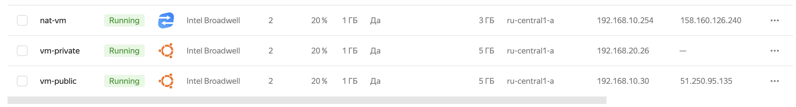

# Домашнее задание к занятию «Организация сети»

---
### Задание 1. Yandex Cloud 

**Что нужно сделать**

1. Создать пустую VPC. Выбрать зону.  
[yandex_vpc_network](https://github.com/kibernetiq/netology_cloud/blob/main/main.tf#L2-L4)
2. Публичная подсеть.  

 - Создать в VPC subnet с названием public, сетью 192.168.10.0/24.  
 [resource "yandex_vpc_subnet" "public-subnet"](https://github.com/kibernetiq/netology_cloud/blob/main/main.tf#L7-L12)
 - Создать в этой подсети NAT-инстанс, присвоив ему адрес 192.168.10.254. В качестве image_id использовать fd80mrhj8fl2oe87o4e1.  
 [resource "yandex_compute_instance" "nat-vm"](https://github.com/kibernetiq/netology_cloud/blob/main/main.tf#L22-L53)
 - Создать в этой публичной подсети виртуалку с публичным IP, подключиться к ней и убедиться, что есть доступ к интернету.  
 [resource "yandex_compute_instance" "vm-public"](https://github.com/kibernetiq/netology_cloud/blob/main/main.tf#L55-L81)

<p align="center">
  
</p>

 ```
yura@Skynet cloud % ssh ubuntu@51.250.95.135

ubuntu@fhmt0ct8j88jsive9odt:~$ ping 8.8.8.8
PING 8.8.8.8 (8.8.8.8) 56(84) bytes of data.
64 bytes from 8.8.8.8: icmp_seq=1 ttl=58 time=22.5 ms
64 bytes from 8.8.8.8: icmp_seq=2 ttl=58 time=19.0 ms
64 bytes from 8.8.8.8: icmp_seq=3 ttl=58 time=19.0 ms
^C
--- 8.8.8.8 ping statistics ---
3 packets transmitted, 3 received, 0% packet loss, time 2003ms
rtt min/avg/max/mdev = 18.993/20.181/22.544/1.670 ms
 ```
3. Приватная подсеть.
 - Создать в VPC subnet с названием private, сетью 192.168.20.0/24.  
 [resource "yandex_vpc_subnet" "private-subnet"](https://github.com/kibernetiq/netology_cloud/blob/main/main.tf#L14-L20)
 - Создать route table. Добавить статический маршрут, направляющий весь исходящий трафик private сети в NAT-инстанс.  
 [resource "yandex_vpc_route_table" "nat-instance-route"](https://github.com/kibernetiq/netology_cloud/blob/main/main.tf#L87-L95)
 - Создать в этой приватной подсети виртуалку с внутренним IP, подключиться к ней через виртуалку, созданную ранее, и убедиться, что есть доступ к интернету.  
 [resource "yandex_compute_instance" "vm-private"](https://github.com/kibernetiq/netology_cloud/blob/main/main.tf#L97-L122)

```
Для подключения на машину vm-private, сначала нужно закинуть приватный ключ на vm-public с которого будет выполняться подключение во внутренней сети.
yura@Skynet cloud % scp ~/.ssh/id_rsa ubuntu@51.250.95.135:.ssh/id_rsa
id_rsa                                                                                      100% 1876    66.3KB/s   00:00
```
```
ubuntu@fhmt0ct8j88jsive9odt:~$ ssh ubuntu@192.168.20.26
The authenticity of host '192.168.20.26 (192.168.20.26)' can't be established.
ECDSA key fingerprint is SHA256:ax/RpKkwZd1aIo3iGjFbwwPjJZk2cWYXflZGsey1U7g.
Are you sure you want to continue connecting (yes/no/[fingerprint])? yes
Warning: Permanently added '192.168.20.26' (ECDSA) to the list of known hosts.
Enter passphrase for key '/home/ubuntu/.ssh/id_rsa': 
Welcome to Ubuntu 20.04.6 LTS (GNU/Linux 5.4.0-167-generic x86_64)

 * Documentation:  https://help.ubuntu.com
 * Management:     https://landscape.canonical.com
 * Support:        https://ubuntu.com/advantage

The programs included with the Ubuntu system are free software;
the exact distribution terms for each program are described in the
individual files in /usr/share/doc/*/copyright.

Ubuntu comes with ABSOLUTELY NO WARRANTY, to the extent permitted by
applicable law.

To run a command as administrator (user "root"), use "sudo <command>".
See "man sudo_root" for details.

ubuntu@fhmnteeaffafp8rvidk3:~$ ping 8.8.8.8
PING 8.8.8.8 (8.8.8.8) 56(84) bytes of data.
64 bytes from 8.8.8.8: icmp_seq=1 ttl=54 time=28.7 ms
64 bytes from 8.8.8.8: icmp_seq=2 ttl=54 time=29.4 ms
64 bytes from 8.8.8.8: icmp_seq=3 ttl=54 time=27.8 ms
^C
--- 8.8.8.8 ping statistics ---
3 packets transmitted, 3 received, 0% packet loss, time 2004ms
rtt min/avg/max/mdev = 27.799/28.621/29.356/0.638 ms
```